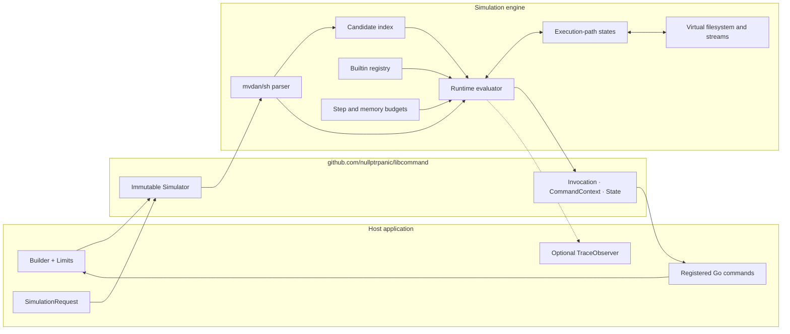
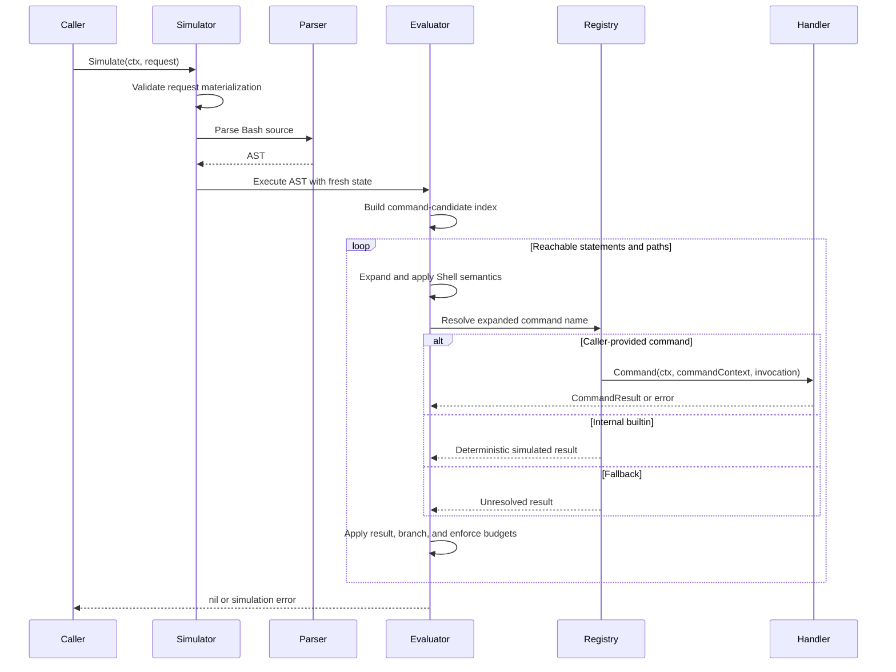
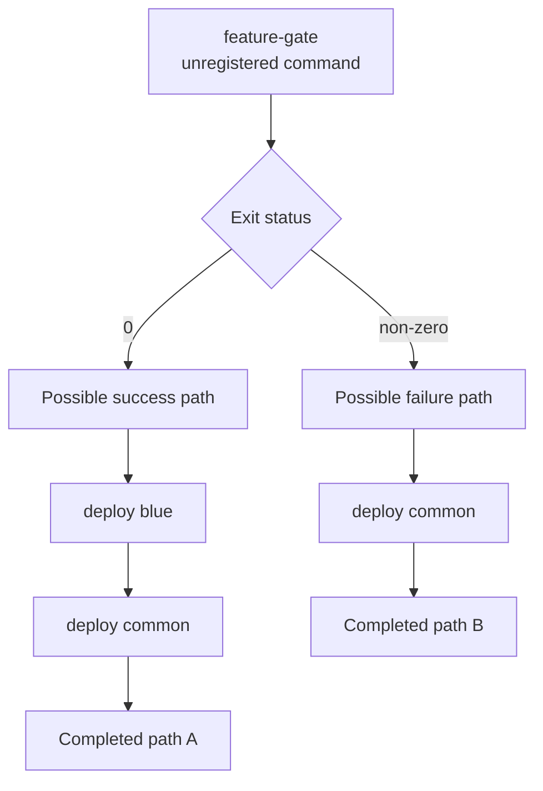
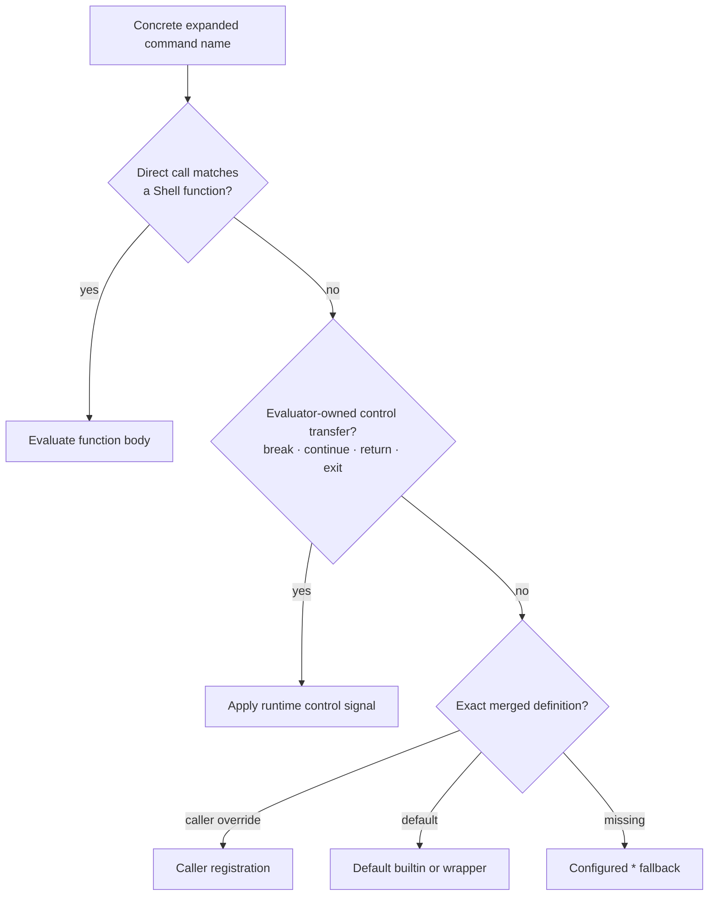
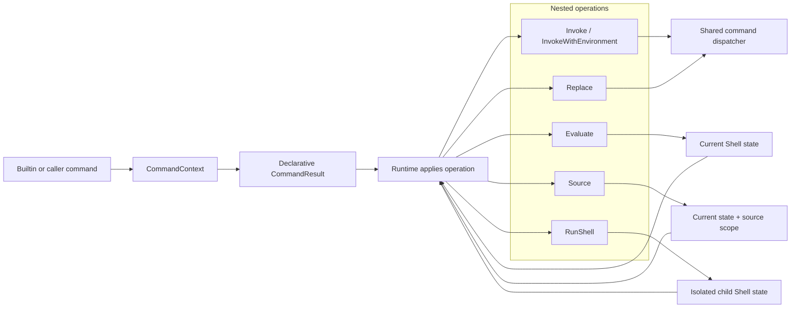
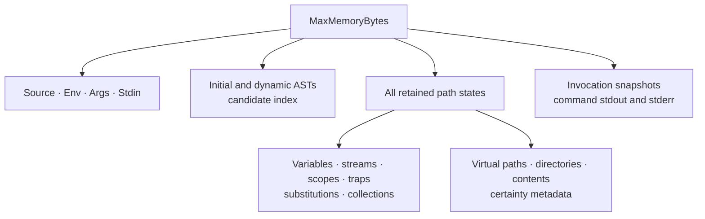
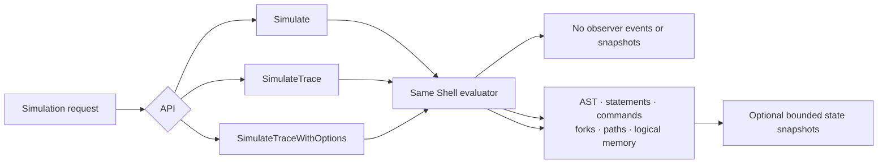

# libcommand

English | [简体中文](README.zh-CN.md)

`libcommand` is an in-process Bash-path simulator for Go. It parses Bash,
models supported Shell state, explores reachable outcomes when values are
unresolved, and dispatches expanded commands to caller-provided handlers.

The simulator does not start host processes or read and write the host
filesystem. It is intended for command discovery, policy evaluation, testing,
and execution visualization where running the original script would be unsafe
or undesirable.

> [!IMPORTANT]
> `libcommand` implements a practical Bash subset. It is neither a complete
> Bash implementation nor an operating-system sandbox. Registered handlers are
> application code and may perform real side effects.

## Highlights

| Capability | Description |
| --- | --- |
| Isolated evaluation | Shell variables, streams, functions, options, and files are held in simulation-local state. |
| Explicit command boundary | Exact command names and a `"*"` fallback map expanded invocations to Go handlers. No command falls through to the host. |
| Conservative uncertainty | Unknown arguments and process state remain typed as unresolved instead of being replaced with fabricated strings. |
| Reachable-path exploration | Status-dependent control flow explores representative success and failure paths under a shared step budget. |
| Nested Shell execution | `eval`, `source`, `bash -c`, `sh`, and custom handlers use the same parser and evaluator. |
| Bounded materialization | Execution steps and logical retained state have configurable per-simulation limits. |
| Optional tracing | Runtime events, path forks, logical memory, and state snapshots can drive debuggers and visualizations. |
| Reusable configuration | A built `Simulator` is immutable and can serve concurrent, isolated simulations. |

## Requirements and installation

- Go 1.26 or later
- `mvdan.cc/sh/v3` is resolved through Go modules

The project currently develops on the `dev` branch. Until a release is tagged,
install that branch explicitly:

```bash
go get github.com/nullptrpanic/libcommand@dev
```

Applications should pin a tag or commit for reproducible production builds.

## Quick start

Register the external commands that the application wants to observe or
implement, build an immutable simulator, and submit Bash source:

```go
package main

import (
	"context"
	"fmt"
	"time"

	"github.com/nullptrpanic/libcommand"
)

func main() {
	simulator := libcommand.NewBuilder().
		Limits(&libcommand.Limits{
			MaxExecutionSteps: 50_000,
			MaxMemoryBytes:    4 << 20,
		}).
		Command("lark-cli", func(
			_ context.Context,
			shell *libcommand.CommandContext,
			invocation *libcommand.Invocation,
		) (*libcommand.CommandResult, error) {
			fmt.Printf("%s %#v\n", invocation.Name, invocation.Args)
			if err := shell.State().SetVariable("LAST_COMMAND", invocation.Name); err != nil {
				return nil, err
			}
			return &libcommand.CommandResult{
				Stdout:   []byte("accepted\n"),
				ExitCode: 0,
			}, nil
		}).
		Build()

	ctx, cancel := context.WithTimeout(context.Background(), 30*time.Second)
	defer cancel()

	err := simulator.Simulate(ctx, &libcommand.SimulationRequest{
		Source: `lark-cli im messages-send --text "$MESSAGE"`,
		Env:    map[string]string{"MESSAGE": "hello"},
		Args:   []string{"first-argument"},
		Stdin:  []byte("input\n"),
	})
	if err != nil {
		panic(err)
	}
}
```

`SimulationRequest.Stdin` is a finite concrete stream. A nil or empty slice
means immediate EOF. The script name exposed as `$0` is `command.sh`.

## Architecture

### System overview

The public package owns configuration and API contracts. `internal/runtime`
owns Shell grammar and execution mechanics, while `internal/builtin` owns
call-like command semantics. This keeps handlers and builtins on the same
dispatch path without exposing runtime path construction.



| Area | Responsibility |
| --- | --- |
| Public package | Builder, limits, simulation requests, handlers, typed invocations, state mutation API, and tracing API. |
| `internal/runtime` | Parsing integration, expansion, assignments, functions, operators, control flow, pipelines, redirections, virtual IO, branching, cancellation, and budgets. |
| `internal/builtin` | Deterministic command implementations and wrappers such as `echo`, `cd`, `env`, `eval`, `source`, and `bash`. |
| `internal/materialize` | Overflow-safe logical byte accounting and the default materialization limit. |
| `cmd/libcommand` | Example CLI that prints simulated `lark-cli` invocations. |
| Playground | Browser UI, Web Worker, and WebAssembly runtime for AST and live-runtime visualization. |

### Simulation lifecycle

Each `Simulate` call creates a new execution context and isolated state. The
`Simulator` command table and limits are reused; request data and path state
are not shared between calls.



The evaluator checks `context.Context` between execution units. Command
handlers run synchronously and must return promptly when the context is
canceled; an in-process handler cannot be forcibly interrupted.

## Path exploration and unresolved data

The default `"*"` command returns an unresolved result. Unknown stdout, stderr,
and exit status propagate through supported assignments, substitutions,
pipelines, redirections, virtual files, and builtin commands. A branch is
created only when control flow must observe an unknown outcome.

For example:

```bash
feature-gate && deploy blue
deploy common
```



The common suffix is evaluated once per retained path, so the same handler may
be called more than once. Callback order is deterministic within one
simulation, but callbacks are not deduplicated or transactional.

Unknown data never crosses an application-command boundary as a fabricated
concrete value:

- `ArgumentString` contains a concrete argument.
- `ArgumentUnresolved` represents a whole argument whose value is unknown.
- `Invocation.Unresolved.Env` lists unresolved exported variable names.
- `Invocation.Unresolved.Dir` and `Invocation.Unresolved.Stdin` qualify the
  working directory and input stream.

An unknown command name, dynamic source string, redirection path, or array
index cannot be enumerated safely and produces a source-positioned unresolved
semantics error where a concrete value is required.

## Command dispatch and override rules

`Build` copies the default registry and then overlays user registrations. The
last registration for a name wins. Exact lookup always precedes `"*"` fallback
lookup, and no lookup starts a host process.



`command` and `builtin` wrappers deliberately bypass Shell functions and
dispatch through the same exact definition table. A caller registration can
replace any default call command, including `echo`, `cd`, `eval`, `source`,
`exec`, `command`, and `builtin`. The four evaluator-owned control transfers
cannot be replaced by a Builder registration.

The default registry includes common Shell builtins and deterministic
in-process helpers:

| Category | Commands |
| --- | --- |
| Basic | `:`, `true`, `false`, `echo`, `printf`, `pwd`, `cd`, `wait` |
| Input and variables | `read`, `mapfile`, `readarray`, `set`, `shift`, `unset`, `getopts`, `shopt` |
| Declarations | `declare`, `local`, `export`, `readonly`, `typeset`, `let` |
| Conditions and traps | `test`, `[`, `trap`, `type` |
| Dispatch and dynamic execution | `command`, `builtin`, `env`, `exec`, `eval`, `source`, `.`, `bash`, `sh` |
| Simulated utilities | integer `seq`, stdin-based `base64`, and line-based `rev` |

## Nested and dynamic Shell execution

Builtins and user handlers return declarative operations through
`CommandContext`. The callback does not recursively drive the evaluator or
construct path results. After the callback returns, runtime applies the
operation through the normal parser, dispatcher, branching, and budget logic.



The operations have intentionally different state boundaries:

| Operation | Evaluation state | Observable effect |
| --- | --- | --- |
| `Evaluate` / `eval` | Current Shell state | Variable and filesystem changes persist on each resulting path. Dynamic AST nodes join candidate discovery and tracing. |
| `Source` / `source` / `.` | Current Shell state with source depth and optional positional-argument scope | Sourced changes persist; temporary positional arguments are restored; `return` exits the sourced content. Only virtual files are read. |
| `RunShell` / `bash` / `sh` | Fresh child Shell initialized from exported variables, directory, stdin, requested options, and a cloned virtual filesystem | Child-local variables do not leak back. Output, status, consumed input, issues, and resulting virtual filesystem are merged into parent paths. |
| `Invoke` | Current state, without Shell-function lookup | The selected exact command runs through the standard invocation contract. |
| `Replace` / `exec` | Current state | A successful replacement terminates that execution path. |

A custom command can evaluate generated Bash without receiving internal path
types:

```go
builder.Command("evaluate", func(
	_ context.Context,
	shell *libcommand.CommandContext,
	_ *libcommand.Invocation,
) (*libcommand.CommandResult, error) {
	return shell.Evaluate(`record generated`, "generated", 1), nil
})
```

## State and command contracts

Every command receives a read-only `Invocation` and a call-scoped
`CommandContext`. `State()` exposes supported mutations without exposing
runtime path construction:

- `Directory` and `ChangeDirectory`
- `Variable`, `SetVariable`, and `UnsetVariable`
- virtual filesystem, input, option, lookup, arithmetic, and nested-execution
  operations exposed by `CommandContext`

State mutations are path-local, copy-on-write, and checked against the logical
materialization budget. Commands must not retain `CommandContext` or `State`
pointers after returning.

Result behavior is explicit:

| Return | Meaning |
| --- | --- |
| Non-nil result, nil error | Apply stdout, stderr, exit code, action, or a declarative operation. |
| `&CommandResult{Unresolved: true}`, nil error | Output streams and exit status are unknown. |
| Nil result, nil error | Decline the invocation and use unresolved-command behavior. |
| Non-nil error | Abort simulation and return the error. |
| `CommandStop` | Terminate all active and pending paths successfully. |

Handler panics are converted to simulation errors. Returned stdout and stderr
are budget-checked after the callback returns, but external side effects that
already occurred cannot be rolled back.

## Resource model

Each simulation has two independent default limits:

| Limit | Default | Scope |
| --- | ---: | --- |
| `MaxExecutionSteps` | 10,000 | Dynamic statements, command calls, and additional successors created during path exploration. |
| `MaxMemoryBytes` | 2 MiB | Initial request and conservative logical materialization retained by the simulator. |



This is a conservative logical-data ceiling, not a Go heap or process RSS
limit. Parser internals, Go runtime overhead, and allocations made inside a
handler before it returns cannot be hard-limited in process. For untrusted
Bash, combine these budgets and context deadlines with process-level isolation
appropriate to the deployment.

## Tracing and Playground

Tracing is opt-in. `Simulate` does not build trace indexes, capture state
snapshots, or deliver events. `SimulateTrace` streams lightweight events
synchronously. `SimulateTraceWithOptions` can additionally capture bounded
state and direct command output snapshots.



Observers execute on the simulation goroutine. A slow or blocking observer
therefore adds latency to traced simulations. Returning `false` disables later
events without stopping Shell evaluation. `TraceNode.Embedded` identifies a
nested evaluation detail such as a condition command, command substitution, or
pipeline operand. It is presentation metadata only: node IDs, execution events,
and Shell behavior are unchanged, so clients may fold it in an AST view while
retaining it in an execution-oriented view. `TraceNode.FlowGroup` identifies
sequential bodies versus alternative bodies under one parent for layered graph
layout. `TraceNode.FlowCanSkip` marks a conditional container that can continue
without entering any visible body, such as an `if` without `else`. Both fields
are presentation metadata and have no evaluation semantics.

The browser Playground compiles the simulator to WebAssembly and runs it in a
disposable Web Worker. It provides separate AST and live Runtime views,
command registration, path visualization, execution controls, and logical
memory snapshots.

### Playground preview

**Live Runtime flow.** Expanded commands appear in execution order while the
active node, graph position, logical memory, and node inspector follow the
simulation.


**Live AST walkthrough.** The recording starts in the AST perspective and
clicks **Run simulation**. The parsed topology stays fixed while reached nodes
are highlighted in execution order; unreached syntax remains dashed. Nested
evaluation details are folded into their owning statement, while real branch
and loop bodies remain visible. Syntax dynamically parsed by `eval`, including
the final `lark-cli` call, is attached to the same AST as it is discovered.


```bash
make playground
./target/playground/playground -addr 127.0.0.1:8080
```

Open `http://127.0.0.1:8080`. See [playground/README.md](playground/README.md)
for the UI model, JavaScript handlers, deployment boundary, and graph legend.

## Supported Bash subset

The supported subset focuses on common orchestration scripts:

- scalar variables; indexed and associative arrays; exported variables;
  positional parameters; quoting; parameter, arithmetic, brace, and supported
  glob expansion;
- sequential statements, `if`, `case`, `&&`, `||`, negation, word and
  arithmetic `for`, `while`, and `until`;
- functions, subshells, command substitutions, pipelines, background
  commands, and `wait` without job operands;
- virtual files, here-documents, here-strings, common redirections, and process
  substitutions;
- `test`, `[`, supported `[[` expressions, declarations, options, traps,
  input builtins, loop control, and function returns; and
- `command`, `builtin`, `env`, `exec`, `eval`, virtual-file `source`, and
  common `bash -c` or `sh` forms.

Support is behavior-specific rather than name-only. Unsupported options and
semantics return errors or unresolved outcomes instead of silently invoking a
host implementation.

## Known limitations

- Arbitrary Bash compatibility is not guaranteed. Uncommon builtins, options,
  coprocess forms, job operands, file descriptors, and redirection forms may
  be unsupported.
- Commands embedded in Python or another non-Bash language are opaque to the
  Bash parser.
- Command stdout and stderr are aggregate streams. Byte-level interleaving and
  independent file-descriptor offsets cannot be reconstructed.
- The virtual filesystem starts empty at `/` and never reads the host
  filesystem.
- Host-dependent identity, process, and randomness values are unresolved or
  rejected when a concrete value is required.
- Unknown strings, field counts, and loop lengths are not exhaustively
  enumerated. The evaluator uses typed unknowns and representative paths.
- In-process evaluation does not replace a container, OS sandbox, or external
  resource limiter for hostile input.

## Project layout

```text
.
├── api.go, builder.go, simulator.go   Public Go API
├── internal/runtime/                 Shell execution and path exploration
├── internal/builtin/                 Unified command registry and builtins
├── internal/materialize/             Logical memory accounting
├── cmd/libcommand/                   Example command-discovery CLI
├── cmd/playground-wasm/              WebAssembly bridge and trace adapter
├── cmd/playground/                   Self-contained Playground server
├── playground/                       Browser application
├── examples/simple/                  Embedded-script Go example
└── testdata/fuzz/                     Persisted fuzzing corpus
```

## Build and validation

Build all distributable commands into `target/`:

```bash
make all
```

| Artifact | Path |
| --- | --- |
| Example CLI | `target/libcommand/libcommand` |
| Self-contained Playground | `target/playground/playground` |

Remove build output with `make clean`.

Run the repository validation gate with the Go toolchain selected by the
environment:

```bash
./verify.sh
```

The gate runs formatting checks, tests, `go vet`, race detection, and the
repository-wide coverage check. An individual fuzz target can be run with:

```bash
go test -run '^$' -fuzz '^FuzzSimulatorSourceStability$' -fuzztime=10s .
```

## Feedback

Use [GitHub Issues](https://github.com/nullptrpanic/libcommand/issues) for bug
reports and focused feature requests. Reports should include the smallest Bash
sample that reproduces the behavior, the expected reachable command calls, and
the configured limits.
