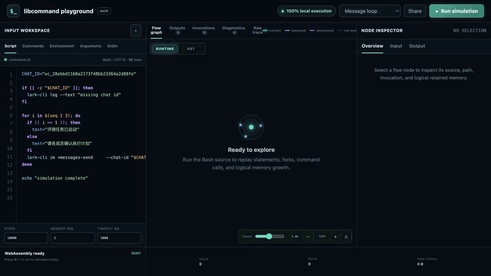
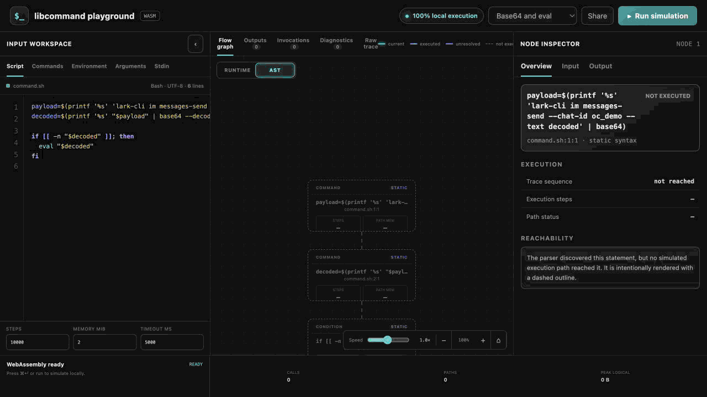

# libcommand Playground

[English](README.md) | 简体中文

Playground 在 Web Worker 中以 WebAssembly 形式运行 `libcommand`，因此 Bash
源码和模拟输入始终保留在浏览器内。它不会执行宿主机命令，也不会把脚本发送给
HTTP Server。

## 构建与运行

构建包含 UI 和 WebAssembly Runtime 的普通可执行文件：

```bash
make playground
```

最终保留的 Playground 产物是 `target/playground/playground`。运行它并打开
`http://localhost:8080`：

```bash
./target/playground/playground -addr 127.0.0.1:8080
```

该文件是自包含的，运行时不依赖 Python、Node 或 Go。构建过程使用当前环境选择的
Go Toolchain。只有需要让 Playground 监听所有网络接口时，才应使用
`-addr :8080`。

运行 `make all` 可以构建全部交付命令。示例 CLI 会写入
`target/libcommand/libcommand`。`cmd/playground-wasm` 是 Playground 的内部资源，
会由 `make playground` 嵌入产物，而不会作为独立产品保留。

使用以下命令删除二进制以及构建中断后可能留下的嵌入暂存目录：

```bash
make clean
```

## 动态演示

### 实时 Runtime 调用流

Message loop 示例展示了 Runtime 如何根据真实展开后的命令调用逐步构建流程图。
Trace 事件到达时节点会依次出现，当前调用会获得明显高亮并被画布自动跟随；选中
`lark-cli` 后，可以在节点检查器中查看该节点的具体
Invocation 和执行结果。



### AST 实时执行

动图先选择 AST 视角，再点击 **Run simulation**。仅解析得到的拓扑保持不变，已
到达节点依次补充真实路径、执行步数和逻辑内存，未被任何路径到达的语法继续以
虚线显示。条件命令、命令替换和管道操作数等父语句内部求值细节会被折叠，真实
的分支体和循环体仍然展示；`eval` 或 `source` 动态解析出的命令只会出现在
Runtime 中，初始 AST 始终保持不变。



## 如何理解流程图

- **Runtime** 是默认视角。它只按执行顺序展示展开后的命令调用，包括由命令替换、
  `eval` 或 `source` 产生的命令。控制语句和展开容器不会显示，因此一个解码后的
  调用会表现为“生成该调用的命令”，随后连接到“最终执行的命令”。每次调用都是
  独立 occurrence；同一个 unresolved 分叉下不同路径的命令处在同一水平线。未
  注册命令会保留为紫色 unresolved 节点。Runtime 节点来自模拟进行期间收到的
  Worker Trace 事件：第一个命令立即出现，其余命令按所选速度逐个展示，而不是
  一次性用完整流程图替换画布。
- 模拟执行前即可查看 **AST**。一次只解析的 Worker 请求会构建当前源码的静态
  语法骨架，但不会执行 Shell 代码或命令 Handler。模拟执行只会在原节点上更新
  状态，不会把新发现的 `eval` 和 `source` 动态语法挂到现有树上。AST 会折叠 Trace
  中标记为 `Embedded` 的条件求值、命令替换和管道操作数，因为父节点已经表达了
  它们；完整细节仍保留在 Trace 中，Runtime 则保留其中真实发生的命令调用。从未
  被任何路径执行的语句仍然保留，便于对比语法结构和可达性。
- 实线节点表示模拟器已经执行过该节点。
- 紫色分叉表示因为某个值或状态 unresolved 而探索出的不同路径。
- 虚线节点表示解析器发现了对应语法，但没有模拟路径执行到该节点。
- AST 节点每次被真实控制流访问时都会重新高亮，因此循环头和循环体语句会在每轮
  再次激活；执行次数会累计，检查器保留并明确标注最新一次上下文。Runtime 会把
  每次具体调用记录为独立 occurrence。
- AST 初始位于顶部中央。顺序语句和循环体尽量沿同一条垂直主线向下推进，真实
  互斥分支处在同一水平线，并在后续
  语句前汇合。没有穷尽分支的条件语句会保留一条直接后继边。循环在 AST 中始终
  是从循环头、循环体到后续语句的一条前向静态序列，不增加迭代回边或零次执行
  旁路；Runtime 转移事件只更新现有 AST 的执行状态，绝不会动态补充 AST 边。
  实时跟随会让当前节点保持水平居中，纵向仅滚动到足以让节点及其上下文保持可见
  的位置。

内存数值来自 `libcommand` 为 `MaxMemoryBytes` 维护的逻辑保留状态统计。它适合
观察路径增长和预算超限，但并不等同于 Go 或 WebAssembly Heap 的实际占用。

缩放控件旁的速度滑块用于控制当前 Runtime 或 AST 视角的实时展示节奏，范围是
`0.1x` 至 `2.0x`；执行结束后没有独立的回放过程。实时运行期间，主按钮用于暂停
或继续可视化。可视化暂停时，Shell 模拟可能已经在 Worker 中结束，Trace 事件会
继续保留在队列中。Stop 会终止正在执行的 Worker、丢弃尚未展示的事件，并保留
已经可见的节点。如果模拟结束速度快于可视化速度，状态会保持为
`Drawing simulation flow`，直到事件队列完全展示完毕。

Commands 页签中的命令定义可以返回配置好的 stdout、stderr 和 Exit Code，返回
错误，或者针对展开后的 Invocation 运行同步 JavaScript 函数体。JavaScript
Handler 可以读取 `invocation.name`、类型化的 `invocation.args`、
`invocation.env`、`invocation.dir`、解码后的 `invocation.stdin` 和 unresolved
元数据。它必须返回一个对象，其中可以包含 `stdout`、`stderr` 和 `exitCode`。
不支持 Promise。未列出的命令使用 Library 自带的 unresolved fallback。

Playground 会把命令检测注册表安装为一层 Builder Middleware，因此匹配的 Builtin、
用户 Handler 和 fallback 都会进入分析，无需分别包装。检测返回值会被丢弃；分类为
风险的错误只用于记录，不会中断模拟，最终结果或错误仍以实际选中的命令为准。命中
的 AST 节点和对应 Runtime occurrence 会显示红色边框，选中节点即可在检查器中查看
稳定的风险 `Type` 和完整检测错误。默认注册表覆盖 `rm`/`find` 根目录级删除、系统关机或重启、
`mkfs*`/`wipefs`/`dd` 块设备写入、把网络通道连接到 Shell 的 netcat 或 `socat`
模式、输入连接到具体 `/dev/tcp` 或 `/dev/udp` 端点的交互式 Shell，以及同时建立
Socket、接管进程流并启动 Shell 的高置信 Python 或 Perl Payload；普通文件写入、
单独的网络客户端或网络重定向、本地解释器程序和本地 Shell 管道不会被归类为风险。

JavaScript Handler 只会在运行 WebAssembly 模拟器的同一个一次性浏览器 Worker
中执行。它不能执行 Server 或宿主机命令；浏览器超时会通过替换 Worker 终止无限
循环。这里并不是可运行任意恶意 JavaScript 的通用沙箱：公开部署时应使用不含
凭据或敏感浏览器存储的独立 Origin。页面加载只会准备当前选择的示例或共享状态，
只有点击 Run 才会开始模拟。包含 JavaScript 的共享 URL 会继续显示额外的审查
提示。

节点检查器包含 Overview、Input 和 Output 页签。命令输入会展示当前 Invocation
的名称、分类参数、工作目录、stdin 和导出环境变量，以及与该节点相关的 Shell
状态。Variables 中不会显示内部 `OPTIND` 状态。Output 只展示当前命令结果或当前
语句带来的 Stream 增量，不会继承整条路径累计的 stdout 和 stderr；空 Stream
仍然是明确的空值。只有 Playground 会启用状态快照和命令输出收集，并为两者共用
4 MiB 展示预算；普通 `Simulate` 调用不会启用 Trace。

浏览器还会限制请求大小、Trace 事件数、渲染节点数、执行时间和内存，从而让共享
的公开 Playground 保持可响应。
